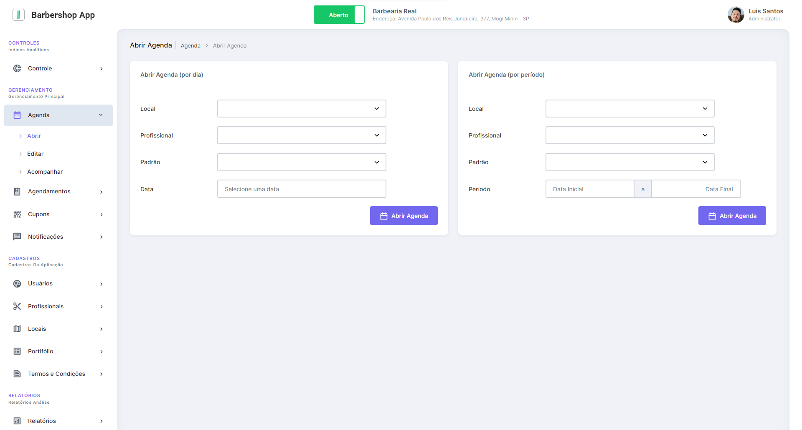

# Aplicativo Barbershop App Book - Dashboard Web/Desktop

Aplicação Web/Desktop para controle de agendamentos de cortes de cabelo e barba realizados no app mobile.
Repostório da aplicação Mobile: https://github.com/luisclsantos/barbershop-app-mobile

## Ferramentas Utilizadas neste projeto:

### Linguagens:
- Javascript ES6
- HTML5
- CSS3

### Framework:
- Electron.js

### Bancos de Dados:
- Firebase Firestore

### Outras Ferramentas:
- Node.js
- JQuery
- Ajax

### Ferramentas Design da Interface:
- Adobe XD
