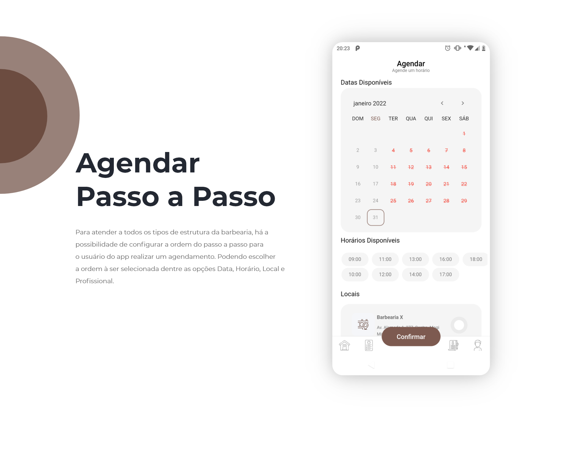

# Aplicativo Barbershop App Book

Aplicação Mobile Android/iOS de agendamentos de cortes de cabelo e barba desenvolvida em Flutter.
Ver no Behance: https://www.behance.net/gallery/136457309/UIUX-Barber-Shop-App-20

## Ferramentas Utilizadas neste projeto:

### Linguagens:
- Dart

### Framework:
- Flutter

### Bancos de Dados:
- Firebase Firestore

### Outras Ferramentas:
- Firebase Storage
- Firebase Authentication

### Ferramentas Design da Interface:
- Adobe XD

### Dependencies (pub.dev):

- flutter_localizations:
- cupertino_icons: ^1.0.2
- dio: ^4.0.4
- flutter_mobx: ^2.0.3+2
- mobx: ^2.0.6+1
- flutter_modular: ^4.4.0
- flutter_feather_icons: ^2.0.0+1
- rive: ^0.8.1
- flutter_svg: ^1.0.3
- firebase_core: ^1.11.0
- cloud_firestore: ^3.1.6
- firebase_database:
- firebase_auth: ^3.3.5
- http: ^0.13.4
- google_sign_in: ^5.2.3
- flutter_facebook_auth: ^4.0.1
- google_maps_flutter: ^2.1.1
- animated_text_kit: ^4.2.1
- shimmer: ^2.0.0
- syncfusion_flutter_datepicker: ^19.4.47
- syncfusion_flutter_gauges: ^19.4.47
- syncfusion_flutter_barcodes: ^19.4.47
- path_provider: ^2.0.8
- path:
- image_picker:
  
### Development Dependencies (pub.dev):
- flutter_test:
- flutter_lints: ^1.0.0
- mockito: ^5.0.17
- modular_codegen: any
- build_runner: any
- mobx_codegen: any
- modular_test: ^1.0.1+1

### Informações Complementares:
- Versão de Compilação: ">=2.15.1 <3.0.0"
- Version: 1.0.0+1

 
